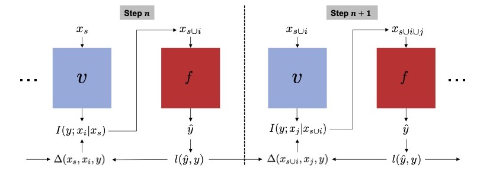

# Estimating Conditional Mutual Information for Dynamic Feature Selection
This paper presents DIME (**di**scriminative **m**utual information **e**stimation), a new modeling approach for dynamic feature selection by estimating the conditional mutual information in a discriminative fashion. The implementation was done using [PyTorch Lightning](https://www.pytorchlightning.ai/index.html). Following is a visualization of the network training:



## Installation
After cloning the repo, run ``cd DIME`` followed by ``pip install .`` to install the package and related dependencies into the current Python environment.

## Usage
The ```experiments/``` directory contains subdirectories for each of the datasets used. In each of the subdirectories, the ```greedy_cmi_estimation_pl.py``` file can be run to jointly train the value network and the predictor network as described in the paper. Each subdirectory also contains a ```*.ipynb``` jupyter notebook to evaluate the trained networks using different stopping criteria.

## Datasets
Following are the publically available datasets we used to evaluate DIME:
- MNIST: A standard digit classification datasets. It was dowloaded directly from PyTorch
- ROSMAP: Complementary epidemiological studies to inform dementia. Dataset can be accessed [here](https://dss.niagads.org/cohorts/religious-orders-study-memory-and-aging-project-rosmap/).
- Imagenette: Subset of the ImageNet image classification dataset with 10 classes. Obtained from [Fast.ai](https://github.com/fastai/imagenette).
- Imagenet-100: Subset of the ImageNet image classification dataset with 100 classes. Obtained from [Kaggle](https://www.kaggle.com/datasets/ambityga/imagenet100).
- MHIST: Downsampled histopathology dataset for image classification. Can be obtained [here](https://bmirds.github.io/MHIST/) after filling out a google form. 
